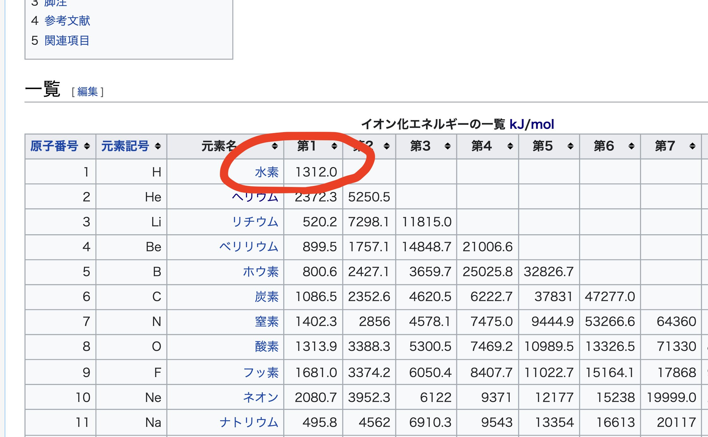

---
# try also 'default' to start simple
theme: geist 
# random image from a curated Unsplash collection by Anthony
# like them? see https://unsplash.com/collections/94734566/slidev
background: https://source.unsplash.com/collection/94734566/1920x1080
# apply any windi css classes to the current slide
class: 'text-center'
# https://sli.dev/custom/highlighters.html
highlighter: shiki
# show line numbers in code blocks
lineNumbers: false
# some information about the slides, markdown enabled
info: |
  ## Slidev Starter Template
  Presentation slides for developers.

  Learn more at [Sli.dev](https://sli.dev)
# persist drawings in exports and build
drawings:
  persist: false

footer: "量子化学勉強会 1日目"
---

# Hi There

---

# 光とは波である

 

> 「電磁波」とは、電磁的エネルギーが空間を振動しながら伝播していく物理現象を指して言う言葉です。 ( [第2回「光」は「電磁波」の一種｜CCS：シーシーエス株式会社](https://www.ccs-inc.co.jp/guide/column/light_color/vol02.html)) 

 

- 光の強さ: 振幅の2乗に比例
- エネルギー: 振動数に比例
  - 短波長: 赤外線
  - 長波長: 紫外線

---

# 光電効果(photoeletric effect)
金属の表面に紫外線を当てたら電子が飛び出てくる

 

## 光が粒子であることがわかった

### 用語
- 光子(Photon): 光を粒子とみたときの名称
- 光電子: 飛び出る電子
- 光(電磁波の意味で)
  - 振動数 $\nu$: 1秒間に振動する回数
  - 強さ: 振幅の2乗に比例

---

# 普通に考えると

- 光のエネルギー = 光電子のエネルギー  (エネルギーの保存則)
  - 光のエネルギーは振動数と強さに比例
  - エネルギーが強い → 電子が飛ぶ

# 結果
- 電子のポーンは光の強さに依存しない
  - 強さはエネルギーじゃないの!?
- 光が強くても電子がポーンしない
  - 振動数が小さい時
  - なぜ??

## こいつら波じゃねーじゃん!!

---

# Einsteinの説明

 

振動数$\nu$の光を**エネルギー$h\nu$を持つ粒子**(光子)とみなす.
 1つの光子が1つの電子と衝突する際にエネルギーを受け渡している.

光の強さは光子の数だから、電子のポーンには影響しない!

$$
K = E - W = h(\nu - \nu_0)
$$
- $K$: 光電子の運動エネルギー
- $E$: 光のエネルギー($h\nu$でしたね)
- $h$: プランク定数($6.6 \times 10^{-34} Js$)
- $\nu_0$: 限界振動数
  - 初めてポーンするときの振動数(前ページを参照)
<note>プランク定数はスケーリング的な意味合い</note>
 

### 光は粒子でした　めでたしめでたし

---

# de Broglie波
粒子の波動性

$$
p = \frac{h}{\lambda}
$$
photonの運動量$p$はコンプトン効果からわかる. $h$はプランク定数, $\lambda$は波長.波長に反比例カナ.

**逆に, 運動量を持つ粒子も波動なのでワ**❓

de Broglie方程式
$$
\lambda = \frac{h}{p}=\frac{h}{mv}
$$
<note>運動エネルギー$p$は$mv$と等価です(定義)</note>

<note>光子なら速さ$v$は光速$c$ですね</note>

---

# 粒子も波でワ❓

## ブラッグ反射

X線をいろいろな方向から当てると角度$\theta$によって反射したり反射しなかったり.

ブラッグの条件
$$
2d sin\theta = n\lambda
$$
$d$: 原子面間隔, $\lambda$: 波長, nは任意の自然数
 

位相が同じだと強めあう(干渉)

- 反射する
- 光が干渉している 
- 位相が同じ光がたくさん

## 電子でも成立

Davisson-Germerの実験ともよばれている.

 

---

# 原子の復習

- **電子** -1の電荷を持っている, 原子の構成粒子
- -- 原子核の近くから配備されている(K殻, L殻, ...)
- -- 外側の電子ほどエネルギーが高い
- -- 原子によってイオン化エネルギーが決まっている

<note>化学セミナーに書いてあったYO</note>

# 今回わかること

### なぜ電子は原子核の近くにいたがるのか

電子の軌道半径とエネルギーの関係を求めます!

水素原子を使います. 他の原子では示せないのですが, 現実をみてみるとどの電子も原子核の近くにいたがってますね.

### 水素原子の第1イオン化エネルギー

$1312.0$kJ/molですね. <- 導出するよ

---

# 水素原子のスペクトル

横軸波長の水素原子のスペクトル

- -- 電子はK殻にいる
- -- 高温にする(エネルギーをあたえる)
- -- 外の軌道(L殻, M殻...)に移る
- -- エネルギーの低い軌道に戻る
- -- 光子を出す

とびとびで光っているのは電子のいられる位置が決まっているから.

# 何がわかるのか
- **スペクトルの予想** 嬉しいかは知らん
- **電子の軌道半径** ほう
- **エネルギーと軌道半径の関係** ほうほう
- **電子の安定した状態** なるほどね?

これからわかる

- **Rydberg** - 実験データからスペクトルの予想の式を立てた
- **Bohr** - 理論的に**Rydberg**の式を導出した

---

出てくる光子のエネルギーは軌道上のエネルギーの差だよ
$$
E_{光子} = h \nu = \frac{hv}{\lambda} = \frac{hc}{\lambda}
$$

$$
E_{光子} = \Delta E = E_{n_2} - E_{n_1}
$$

エネルギーは保存されるので余ったエネルギーが光子に変わったのカナ

# Rydbergの式
$n_2$番目の軌道から$n_1$番目の軌道に移動するときの水素原子のスペクトル波長を定式化
$$
\tilde{\nu} = \frac{1}{\lambda} = R(\frac{1}{n_1^2} - \frac{1}{n_2^2})
$$

$R$: Rydberg定数($109677.6 cm^{-1}$)

$n_1, n_2$:任意の自然数  

- h: プランク定数(Js)
- $\tilde{\nu}$: 波数($cm^{-1}$) 波長の逆数

<note>振動数$\nu$と波数$\tilde{\nu}$は別人であることに注意!</note>

たしかに正しいけど, 導出されたわけじゃないから本当か??という疑問が残る

---

# Bohrの量子条件

[^1]: 角運動量が離散的な値を取るというのが本来の意味

電子が動ける条件[^1]
$$
mvr = n\frac{h}{2\pi}
$$

de Broglie方程式より
$$
2\pi r = n \frac{h}{mv} \\

2\pi r = n \lambda
$$

$2\pi r$: 半径$r$の円の外周, $\lambda$: 電子を波動とみたときの波長
<note>このときの波長は具体的な意味を持たない</note>

#### 位相がずれない(定常波) -> 電子が安定する

$n$はK殻, L殻, ...を1, 2, ...に対応づけたものです.

村上陽一. "ニールス・ボーア (1885-1962) の功績." 伝熱: journal of the Heat Transfer Society of Japan 49.206 (2010): 25-29.

---

# Rydbergの式を導出します

### 原子内の力のつり合いを計算

外向き: 電子の遠心力(回っているので)  
内向き: Coulomb力

### エネルギーを立式してみる

**すべての**エネルギーなので, 運動エネルギーと位置エネルギーの和である力学的エネルギーを求める

### 電子の軌道半径を求める

クーロン力 = 遠心力 という式から,
力学的エネルギーは2通りの$r$に関する式で表現できる.
それを$r=$という形になおす.

### エネルギーを求める
さっき求めた式には非自明な変数$r$が含まれていたので, 1つ上で求めた$r$を代入して完成.

---

遠心力とクーロン力は等しいのです
$$
\mu r \omega^2 = \frac{1}{4\pi \epsilon_0} \frac{e^2}{2r}
$$

換算質量(電子の質量$m_3$と核の質量$M$)
$$
\frac{1}{\mu} = \frac{1}{m_e} + \frac{1}{M}
$$

$r$: 電子の回転半径, $\omega$: 角速度
速さ$v$: $r^2 \omega^2$

$$
T = \frac{1}{2}mv^2= \frac{1}{2} \mu r^2 \omega^2 = \frac{1}{4\pi \epsilon_0}\frac{e^2}{2r} 
$$
$$
V = \int \frac{1}{4 \pi \epsilon_0}\frac{e^2}{r^2} dr
 = -\frac{1}{4\pi \epsilon_0} \frac{e^2}{r}
$$

力学的エネルギー$E$

$$
E = T + V = - \frac{1}{2}\frac{1}{4\pi\epsilon_0}\frac{e^2}{r} = -T
$$

Bohrの量子条件より
$$
\mu r^2 \omega = n\frac{h}{2\pi} = n \hbar
$$

ディラック定数$\hbar=\frac{h}{2\pi}$

$$
E = -T =
-\frac{1}{2} \mu r^2 \omega^2
= -\frac{1}{2}\frac{1}{\mu r^2} n^2 \hbar^2 
$$

$$
E = -T = - \frac{1}{4\pi \epsilon_0} \frac{e^2}{2r}
$$

$$
r = \frac{4\pi \epsilon_0 \hbar^2}{\mu e^2} n^2
$$
電子の軌道半径がわかった!

$$
E_n = - \frac{1}{(4\pi \epsilon_0)^2} \frac{\mu e^4}{2n^2\hbar^2}
$$

ある自然数$n$に対応するエネルギー$E_n$がわかった!

---

# エネルギー準位からわかること

$$
E_n = - \frac{1}{(4\pi \epsilon_0)^2} \frac{\mu e^4}{2n^2\hbar^2}
= - \frac{1}{K_0^2} \frac{\mu e^4}{2n^2\hbar^2}

\quad \quad  
r = \frac{4\pi \epsilon_0 \hbar^2}{\mu e^2} n^2

= \frac{1}{K_0} \frac{\hbar^2}{\mu e^2} n^2
$$

- $K_0$ - クーロン力のクーロン定数(N $m^2$ / $C^2$)
- $\mu$ - 電子の質量(kg)[^1]
- $\hbar$ - ディラック定数(Js)
- $e$ - 電子の電荷( C )
- $n$ - 電子の軌道の番号(近い順)

エネルギーが最も小さいときの状態を**基底状態**, それ以外の状態を**励起状態**といいます

[^1]: 原子核との換算質量です

###  電子が原子核の近くにいる理由
- $n=1$
- -- エネルギー$E_n$が最も小さい
- -- 軌道半径$r$が最も小さい 
- $n=\infty$
- -- エネルギー$E_n$が最も大きい
- -- 軌道半径$r$が最も大きい

---

## Rydbergの式が導出できていた

$$
\Delta E = E_{n_2} - E_{n_1} = 

\frac{1}{(4\pi \epsilon_0)^2} \frac{\mu e^4}{2\hbar^2}
(\frac{1}{n_1^2}- \frac{1}{n_2^2})
$$

波数とエネルギーの関係から
$$
\tilde{\nu} = \frac{\Delta E}{ch} = 

\frac{\mu e^4}{8\epsilon_0^2 c h^3}
(\frac{1}{n_1^2}- \frac{1}{n_2^2})
$$

したがって, Rydberg定数も理論的に導くことができる.
$$
R = \frac{\mu e^4}{8\epsilon_0^2 ch^3}
$$

Rydberg定数から$\Delta E$を求める

$$
\Delta E = Rch(\frac{1}{n_1^2} - \frac{1}{n_2^2})
$$

---

# 水素原子の第1イオン化エネルギーを求めてみる

今までの集大成です. 有効数字はガン無視です
$$
\Delta E = Rch(\frac{1}{n_1^2} - \frac{1}{n_2^2})
$$

$R$: $1.09737 \times 10^7 m^{-1}$
&emsp;    $c$: $2.9979 \times 10^8$m/s
&emsp; $h$: $6.626 \times 10^{-34}$Js

イオンになるということは, 1番目の軌道から∞番目の軌道に遷移したと考えられます.

つまるところ, $n_2 = 1$, $n_1 = \infty$としてあげればよさそうです.

$$
\lim_{n_2 \to \infty} \frac{1}{1} - \frac{1}{n_2} = 1
$$

$$
\Delta E = 1.09737  \times 10^7 \times 2.9979 \times 10^8 \times 6.626 \times 10^{-34} = 2.179825 \times 10^{-18} J
$$
1原子当たりの第1イオン化エネルギーがわかったので, kJ/molに直します.

$$
2.179825 \times 10^{-18} \times 6.022 \times 10^{23} \div 10^{-3} = 1.31269 \times 10^{4} kJ/mol
$$

---

